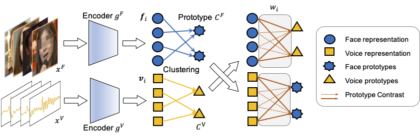

# Unsupervised Voice-Face Representation Learning by Cross-Modal Prototype Contrast

This is a PyTorch implementation for CMPC, as described in our paper:


**[Unsupervised Voice-Face Representation Learning by Cross-Modal Prototype Contrast](https://arxiv.org/abs/2204.14057)**

```angular2html
@article{zhu2022unsupervised,
  title={Unsupervised Voice-Face Representation Learning by Cross-Modal Prototype Contrast},
  author={Zhu, Boqing and Xu, Kele and Wang, Changjian and Qin, Zheng and Sun, Tao and Wang, Huaimin and Peng, Yuxing},
  journal={arXiv preprint arXiv:2204.14057},
  year={2022}
}
```





We also provide the [pretrained model](#unsupervised-training) and [testing resources](#testing-data).
### Unsupervised Training


### Requirments:

* torch==1.7.0+cu110
* matplotlib==3.4.3
* pykeops==1.5
* pandas==1.1.3
* librosa==0.6.2
* Pillow==9.0.1
* PyYAML==6.0
* scikit_learn==1.0.2

### Download Pre-trained Models
<a href="https://github.com/Cocoxili/CMPC/releases/download/v1.0.0/checkpoint_CID.pth.tar">CID</a>| <a href="https://github.com/Cocoxili/CMPC/releases/download/v1.0.0/checkpoint_CMPC.pth.tar">CMPC</a>
------ | ------

### Data Pre-processing
Firstly, we extract the logmel feature from the audio data.

```angular2html
cd experiments/cmpc
python data_transform.py --wav_dir 'directory-of-the-wav-file' --logmel_dir 'destination-path'
```


### Unsupervised Training

```angular2html
python train.py CONFIG.yaml
```

### Evalution on our trained model
Experiments on three evalution protocals: matching, verification and retrieval.

```angular2html
python matching.py CONFIG.yaml --ckp_path 'checkpoint path'
python verification.py CONFIG.yaml --ckp_path 'checkpoint path'
python retrieval.py CONFIG.yaml --ckp_path 'checkpoint path'
```

### Testing data

[Matching](./data/matching), [verification](./data/veriflist) and [retrieval](./data/retrieval) testing data is released at [./data](./data) directory.